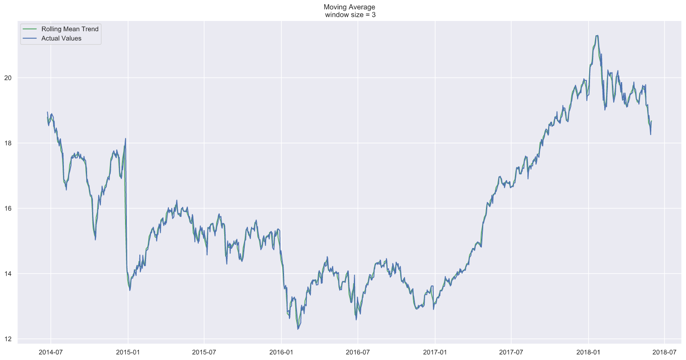
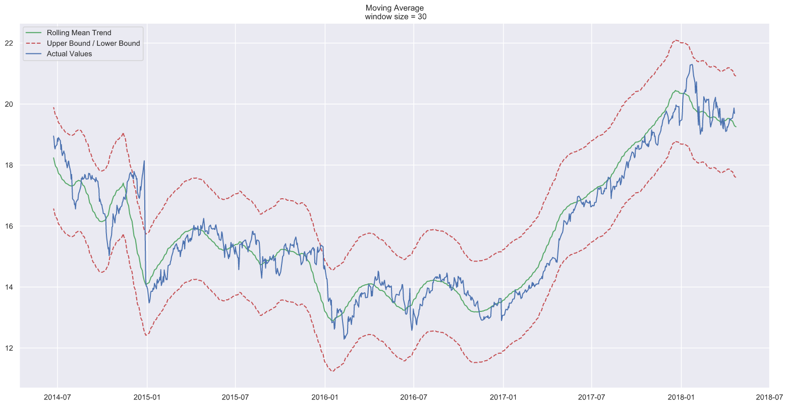
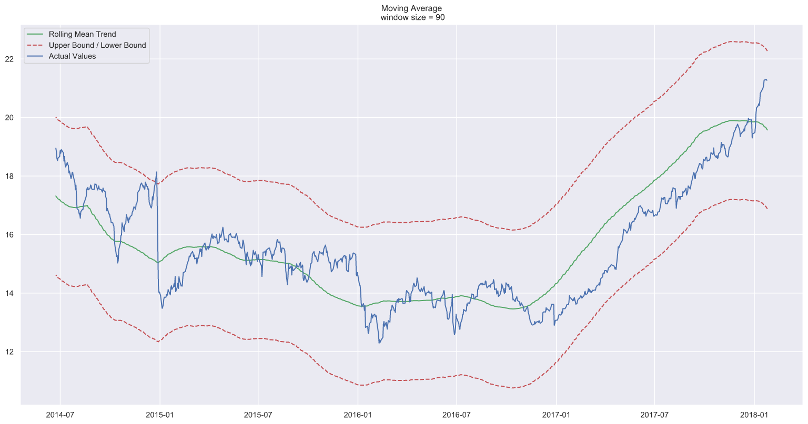
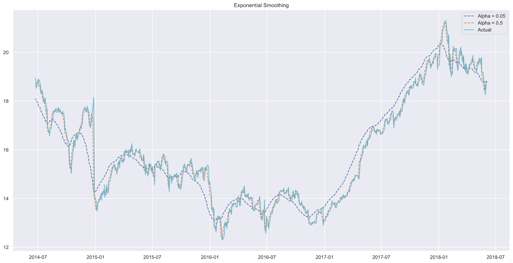
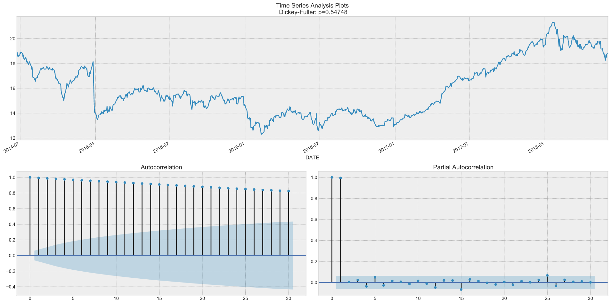
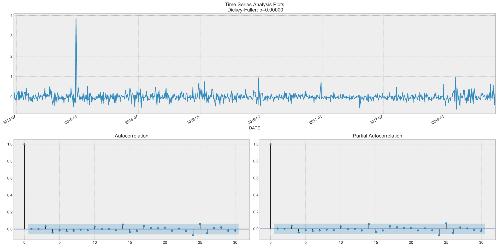
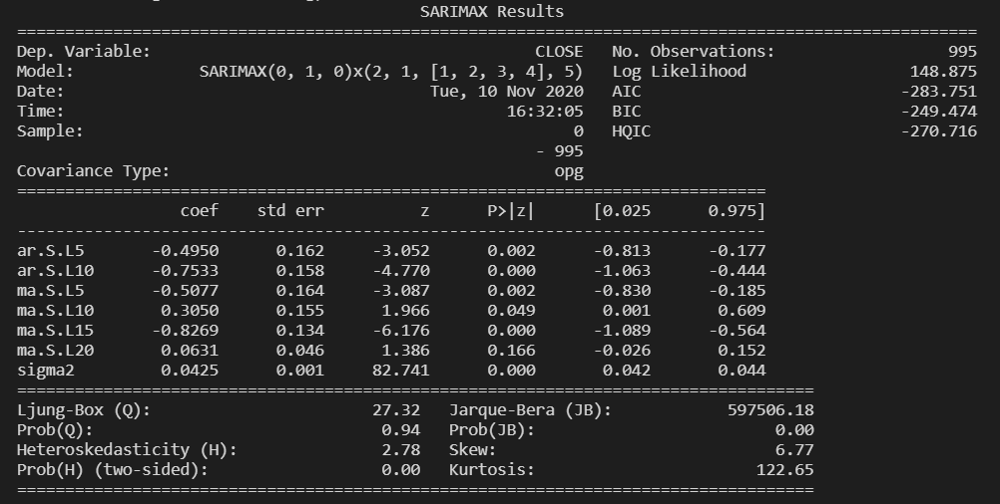

# Stock Prediction 

This project follows the example given in [this article](https://towardsdatascience.com/the-complete-guide-to-time-series-analysis-and-forecasting-70d476bfe775). The Github project of the author, where the dataset is available, can be found [here](https://github.com/marcopeix/stock-prediction).

This project shows how to analyse **time series data**, with modelling using SARIMA (Seasonal Autoregressive Integrated Moving Average) model. 

### Closing Price 

As we plot the closing price over the time period of the dataset, we can see that it is not a **stationary** process, but it is difficult to tell whether there is any **seasonality**. To capture the trend in the data, we plot the moving average. 

### Moving Average 

**Window size = 3 days**

When the window size is too small, the moving average is very similar to the actual values, making it difficult to spot any trend not already obvious on the actual values. 

**Window size = 30 days**

Here, we can see a downward curve at the end, indicating that the stock is likely to go down in the following days. 

**Window size = 90 days**

We can see the same downward curve here. 

### Exponential Smoothing 

Here, an alpha value of 0.05 smoothed the curve while picking up most of the upward and downward trend.

### Making the Series Stationary  

To model the series, we must first transform it into a stationary process. First, we apply the Dickey-Fuller test to see if it is a stationary process. 

By the Dicky-Fuller test, the time series is not stationary, as we expected. From the Auto-Correlation plot, we see that auto-correlation is high and there seems to be no seasonality in the data. 

Therefore, to make the process stationary and to get rid of autocorrelation, we take the first difference (subtract the time series from itself with a lag of one day). 

Now, our data is stationary, and we can start modelling. 

### SARIMA (Seasonal Autoregressive Integrated Moving Average Model)

SARIMA is the combination of simpler models to make a complex model that can model time series exhibiting non-stationary properties and seasonality. 

- **Autoregression model (AR)**: 
        This is basically a regression of the time series onto itself. 
        Here, we assume that the current value depends on its prevous values with some lag. 
        It takes parameter `p` which represents the maximum lag.
        To find it, we look at the partial autocorrelation plot and identify the lag after which most lags are not significant. 
- **Moving average model (MA)**:
        This takes a parameter `q` which represents the biggest lag after which other lags are not significant on the autocorrelation plot. 
- **Order of integration I(d)**:
        The parameter `d` represents the number of differences required to make the series stationary (here, `d = 1`)
- **Seasonality S(P, D, Q, s)**:
        The parameter `s` is the season's legnth. 
        Parameters `P` and `Q` are like `p` and `q` but for the seasonal component. 
        The parameter `D` is the order of seasonal integration representing the number of differences required to remove seasonality from the series.

Before modelling with SARIMA, we must apply transformations to our time series to remove seasonality and any non-stationary behaviours.

We then predicted the closing price of the next five trading days. We calculated that the Mean Absolute Percentage Error of the model to be 79%. 

Comparing our prediction to the real data, we saw that our prediction was not perfect. In fact, the predicted price was essentially flat, meaning that our model was not performing well. This is probably because changes in stock prices are unpredictable. 

